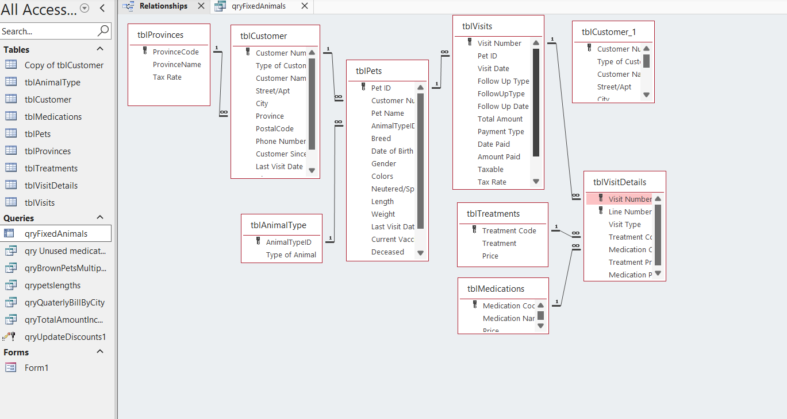
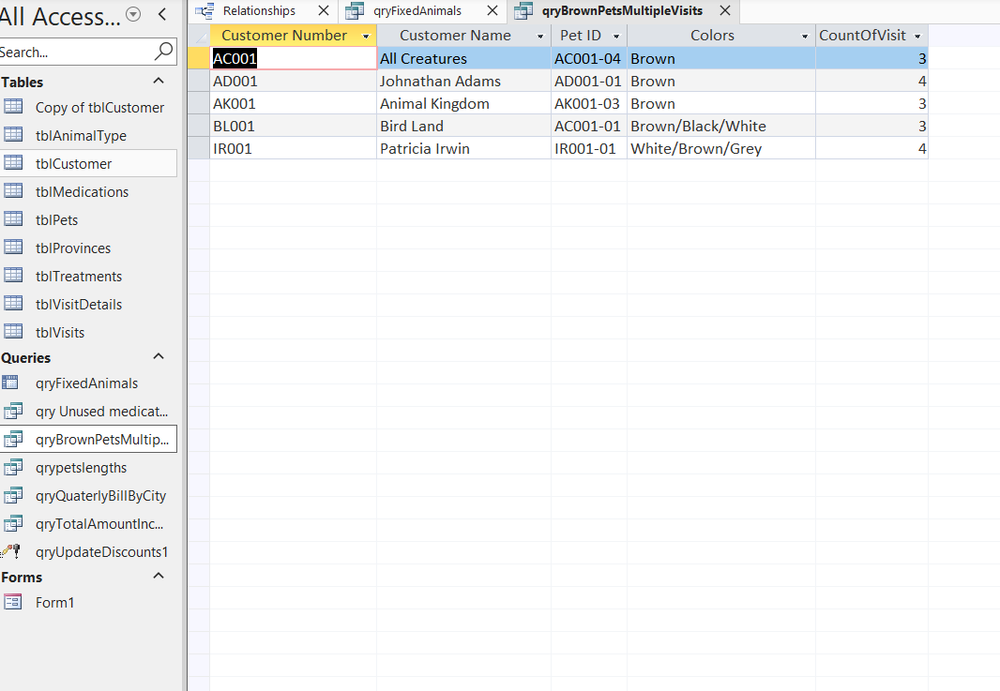
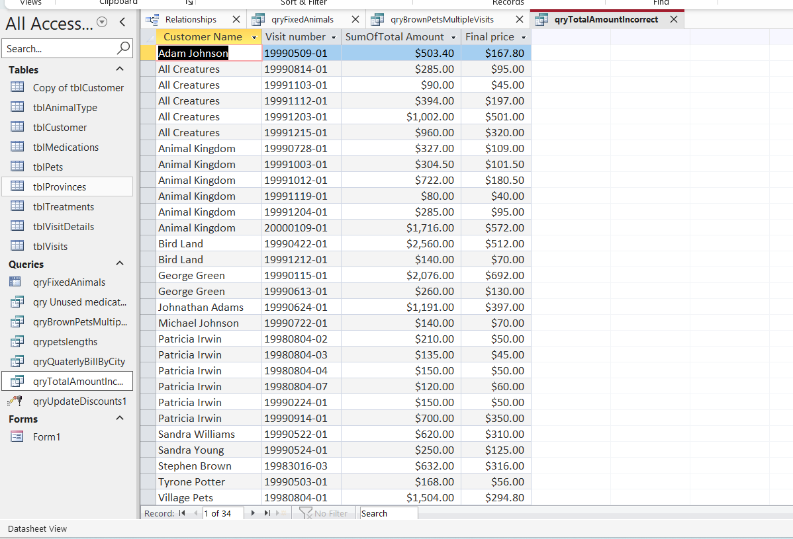
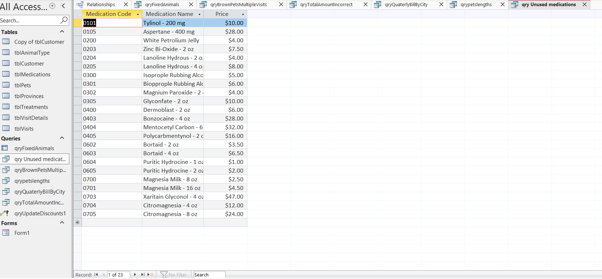
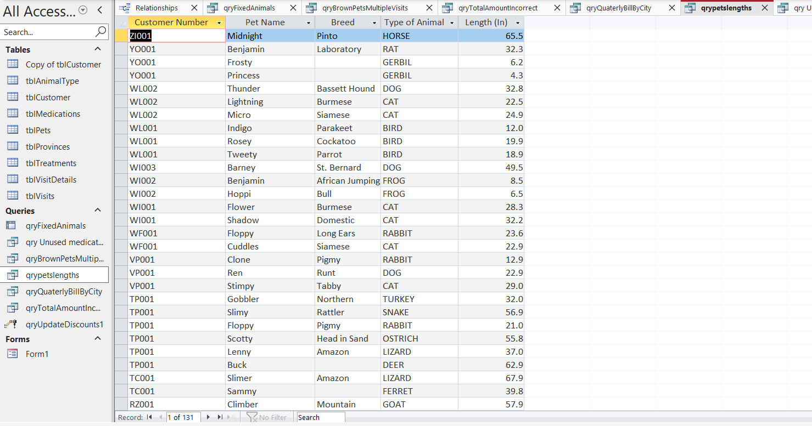

# 🐾 Kelsey Vets Database Project (Microsoft Access)

## 📌 Overview

This project is a **relational database solution built in Microsoft Access** for a  veterinary clinic, Kelsey Vets. It demonstrates practical database design and query development skills used to support real-world business operations such as customer management, pet tracking, visit history, and billing analysis.

The system is designed to help Kelsey Vets:

* Track customers and their pets
* Manage veterinary visits and treatments
* Monitor medication usage
* Analyze billing and financial data
* Generate business insights through queries and reports

---

## 🧱 Database Design (ERD Overview)

The database consists of multiple related tables including:

* **tblCustomer** – Customer information (name, address, contact details)
* **tblPets** – Pet details linked to customers
* **tblVisits** – Visit records and billing data
* **tblVisitDetails** – Line items for treatments and medications
* **tblTreatments** – Treatment types and pricing
* **tblMedications** – Medication inventory and pricing
* **tblAnimalType** – Animal classification data
* **tblProvinces** – Province-level tax and location data

📷 *Refer to the relationships screenshot for full table linkage structure (1-to-many relationships between customers, pets, and visits).*

---

## ⚙️ Tools & Technologies

* Microsoft Access
* SQL (Access Query Language)
* Relational Database Design
* Query Design & Expression Builder

---

## 📊 Key Queries Developed

### 1. Brown Pets with Multiple Visits (`qryBrownPetsMultipleVisits`)

Identifies pets with "Brown" in their color field who have visited the clinic at least 3 times.

**Output:** Customer Number, Customer Name, Pet ID, Colors


### 2. Quarterly Billing by City (`qryQuarterlyBillByCity`)

Calculates total billing per city for a user-selected province.

**Features:**

* Parameter input (Province Name)
* Aggregated billing per city
* Filtered to show only cities with billing > 0
* Output formatted as a readable sentence

---

### 3. Fixed vs In-Tact Animals (`qryFixedAnimals`)

Shows how many pets per customer are spayed/neutered vs not.

**Output:**

* Customer Number
* Customer Name
* Fixed
* In Tact

---

### 4. Billing Validation Query (`qryTotalAmountIncorrect`)

Detects mismatches between stored total amounts and calculated totals (Treatment + Medication).

**Purpose:** Ensures data accuracy in financial records.

---

### 5. Discount Update Query (`qryUpdateDiscounts`)

Updates customer discounts under 20% by increasing them by 10%.

**Type:** Action Query (UPDATE)

---

### 6. Unused Medications (`qryUnusedMedications`)

Lists medications that have never been prescribed in any visit.

**Output:** Medication Code, Medication Name, Price

---

### 7. Pet Length Categorization (`qryPetLengths`)

Classifies pets based on length into business-friendly categories:

* **Big Boy** (≥ 85)
* **Average** (40–84)
* **Teeny Weeny** (15–39)
* **Itty Bitty** (< 15)

**Output:** Customer Number, Pet Name, Breed, Animal Type, Length, Category

---

## 📌 Key Skills Demonstrated

* Relational database design
* Query writing (SELECT, UPDATE, JOINs, aggregation)
* Conditional logic using IIF()
* Data validation and reporting
* Business insight generation from raw data


## 📁 Repository Structure (Suggested)

```
Kelsey-Vets-Database/
│
├── README.md
├── screenshots/
│   └──Relationship.png
├── queries/
│   ├── qryBrownPetsMultipleVisits

│   ├── qryQuarterlyBillByCity.sql
│   ├── qryFixedAnimals.sql
│   ├── qryTotalAmountIncorrect

│   ├── qryUpdateDiscounts.sql
│   ├── qryUnusedMedications.sql
│   └── qryPetLengths.sql
```

# screenshots included

* Relationship



* qryBrownPetsMultipleVisits

* qryTotalAmountIncorrect

* qryUnusedMedications.sql

* qryPetLengths.sql

